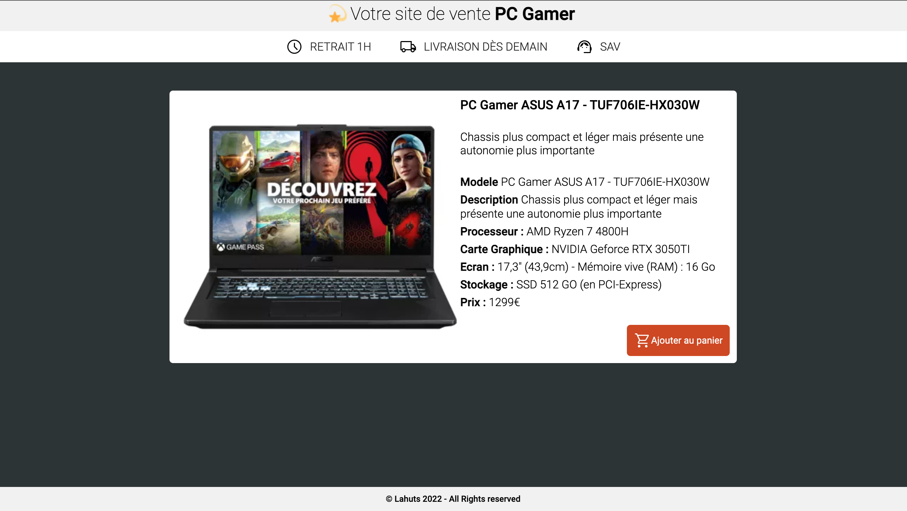
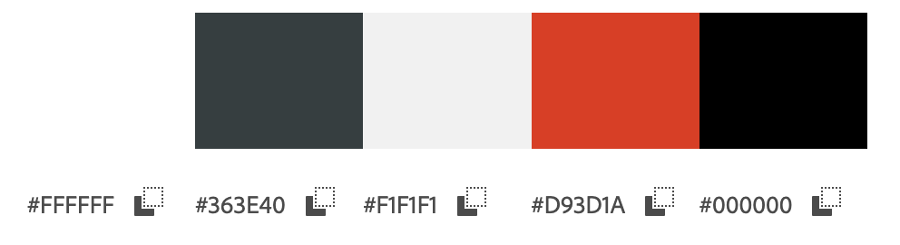

# Rendu du site
## image du rendu du site

## Lien :
[Lien vers le rendu](https://lahuts.github.io/php_maquette/)

## Html :
- Création de la maquette à partir d'un screenshot données
## Css :
- Réalisation de la css  à partir de la maquete html valider
## PHP :
- Adapation de la page html pour la rendre dynamique grace à php

## Fonts :
 - Roboto light 300 disponible sur : [Google Fonts](https://fonts.google.com/specimen/Roboto?query=roboto)

 

 ## Color : 
 ### Charte graphique :
  
